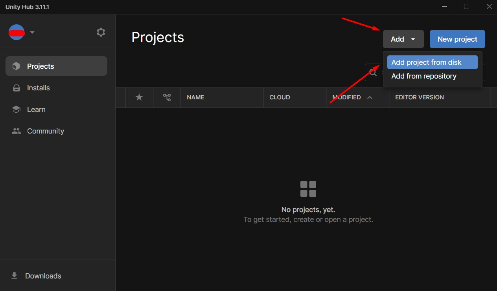
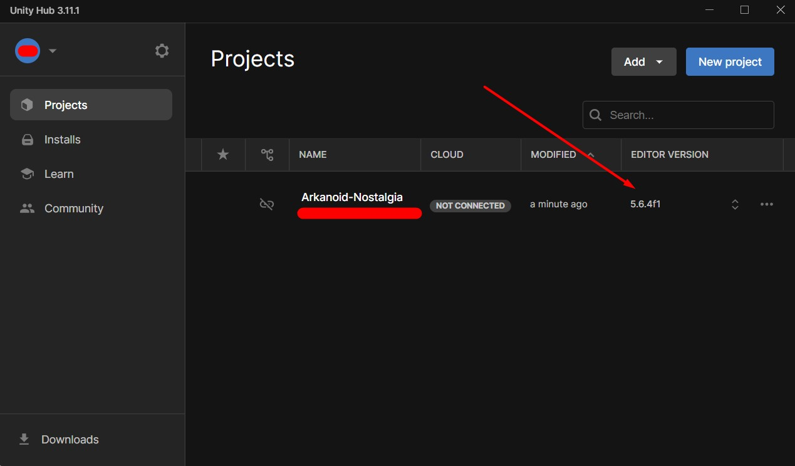
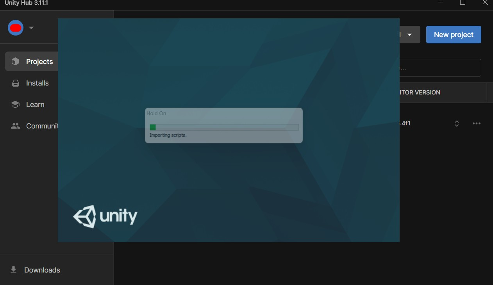
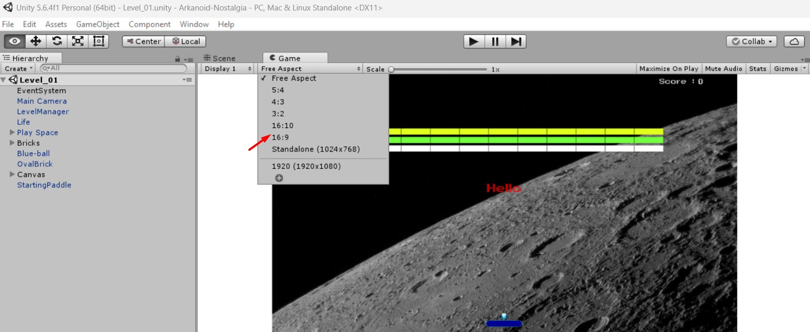
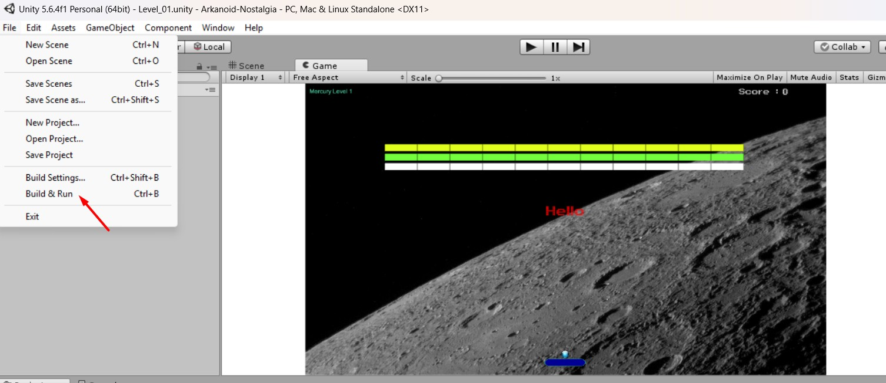
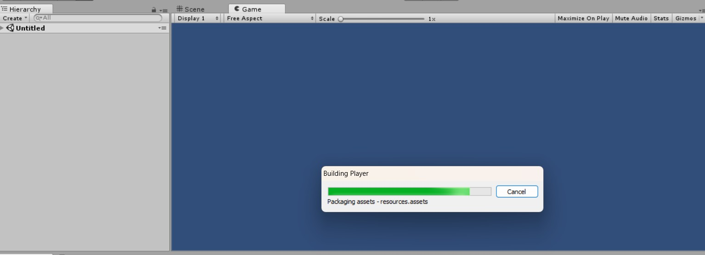
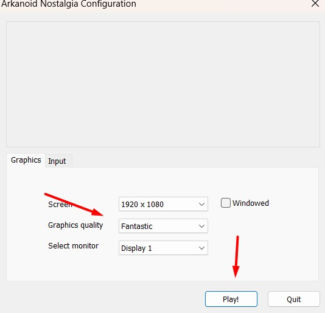
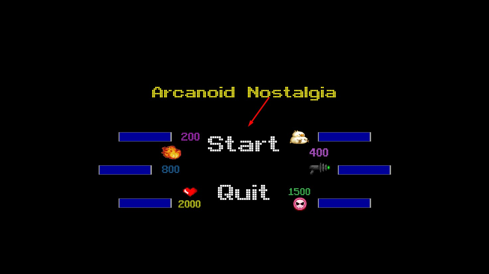
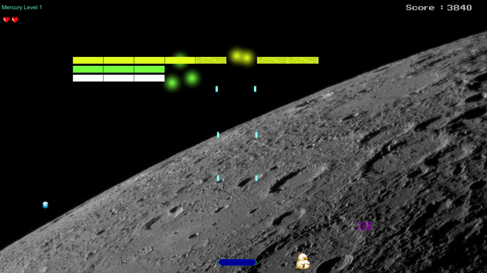

# Arkanoid-Nostalgia

## Description

This game was made with Unity and C#.

Have fun playing this classic game with a modern twist! 

###### This game is not finished or published and the name, code or authors have nothing to do with the original game creators.

## Steps to start and play

### 1. Install UNITY Hub and Unity Editor
   - Download and install Unity Hub from the official website: https://unity3d.com/get-unity/download
  

### 2. Open Unity Hub and sign in or create a new account.
   - After installing Unity Hub, open it and sign in with your Unity account or create a new one if you don't have an account yet.

### 3. Clone project to a folder you want

### 4. Add the project to Unity Hub
   - In Unity Hub, click on the "Add" button in the Projects tab.
   - Navigate to the folder where you cloned the project and select it.
   - The project will now be added to your Unity Hub.

### 5. Make sure the version of Unity Editor is the same as in picture. Else install it.

### 6. Open the project in Unity Editor
   - In Unity Hub, click on the project you just added to open it in Unity Editor.
   - Wait for Unity to load the project and import any necessary assets.

### 7. Choose 16:9 as resolution

### 8. Build and run the game

### 9. Wait some time for everything to load

### 10. Click play

### 11. Start the game!

### 12. Enjoy the game!
	1. Use the mouse to move the paddle left and right. 
	1. Button or space launch the ball

#### The project will be updated soon to 6.0+ unity version along with arrows to play
